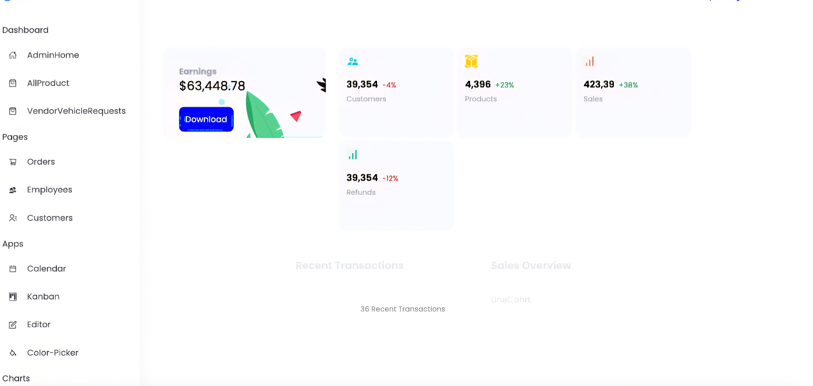
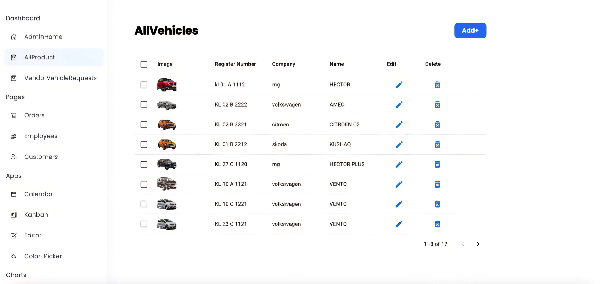
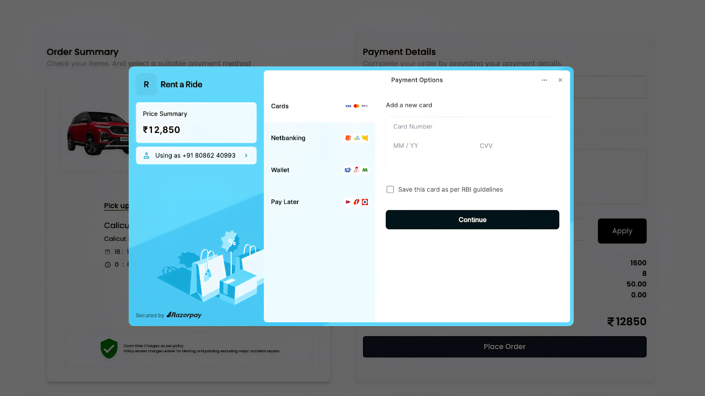
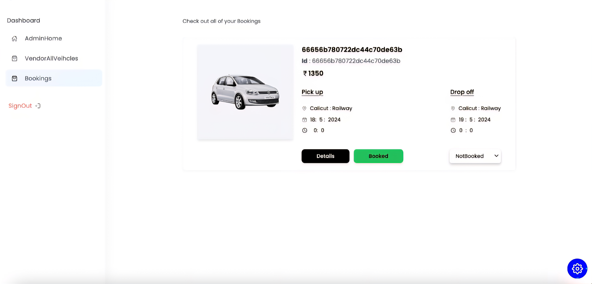
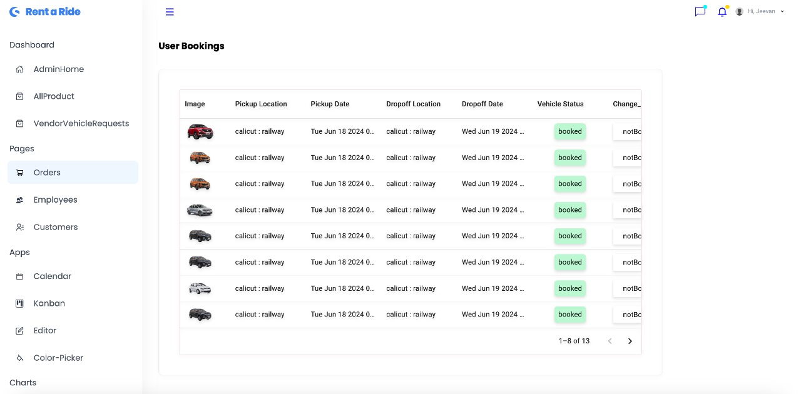
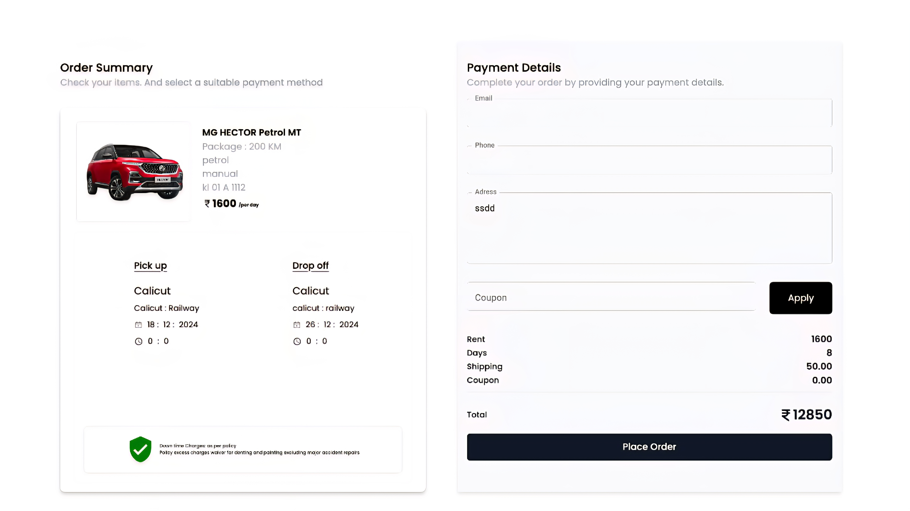

# Rent a Ride
    
## Tech Stack

**Client:** React, Javascript, Redux Toolkit, Material Ui, TailwindCSS, React Toast 
**Server:** Express.js, Mongodb, Cloudinary, Nodemailer , Multer

## Project Description
A full-scale Car Rental Platform with user, admin, and vendor modules, designed to offer seamless vehicle booking, management, and administration, catering to different user roles with distinct functionalities.

**Key Features & Modules:**

**User Module:**

* View and Book Vehicles: Users can view available vehicles and book them online.
* Order Management: View past and upcoming orders; users can only access their own bookings.
* Email Notifications: After booking a vehicle, users receive an email with order details.

**Admin Module:**
* Booking Management: Admins can view and manage bookings, including booking details and statuses.
* Vendor Management: View and approve/reject vendors, as well as remove vendors from the platform.
* Vehicle Management: Admins can view, update, and delete vehicle listings.
* User Management: Admins have the ability to remove users from the platform.
  
**Vendor Module:**
* Vehicle Listing: Vendors can add their vehicles to the platform for approval by the admin.
* Order Notifications: Vendors receive updates on orders when users book their vehicles.

##

**Features & Implementations:**

* JWT Authentication: Integrated JWT access and refresh tokens to secure user, admin, and vendor login flows.

* Role-Based Access: Implemented protected routes and role-based access to restrict access based on user roles (Admin, User, Vendor).

* Search, Sort, Filter Functionality: Enhanced search, filter, and sort capabilities for seamless vehicle browsing and booking.

* Google OAuth: Integrated Google OAuth for quick and secure sign-up/sign-in functionality.

* Cloudinary Integration: Used Cloudinary to handle image and video storage, reducing the database load by optimizing media assets.

* MongoDB: Used four main models to take advantage of MongoDB's referencing functionality, improving data organization and retrieval efficiency.

* Razorpay payment gatway: Integrated for test transactions in sandbox mode. (Without KYC verification uptill now)
  
## Screenshots

### User

### Additional User Screenshots

### Admin

### Additional Admin Screenshots

### Vendor

### Additional Vendor Screenshots

